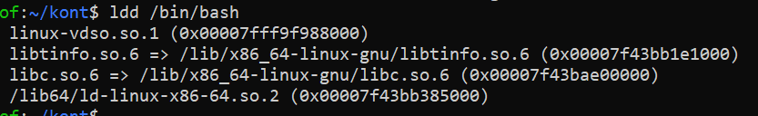

## Denis Karev.
## Группа: Программирование 6 | 3325 / 3424 | 21.09.2022.

### HomeWork 01
### Урок 1. Механизмы пространства имен

### Task 1: необходимо продемонстрировать изоляцию одного и того же приложения (как решено на семинаре - командного интерпретатора) в различных пространствах имен.

### Solution 1:

```mkdir kont``` - создаём директорию

```cd kont``` - переходим в директорию

```ldd /bin/bash``` - смотрим зависимости


```mkdir bin lib lib64``` создаём директории из ldd для послед. копирования 

```cp /bin/bash ./bin/``` копируем bash

копируем библиотечки
- ```cp /lib/x86_64-linux-gnu/libtinfo.so.6 ./lib```
- ```cp /lib/x86_64-linux-gnu/libc.so.6 ./lib```
- ```cp /lib64/ld-linux-x86-64.so.2 ./lib64```

```cp /bin/ls bin/``` копируем ls

```ldd /usr/bin/ls``` смотрим зависимости


копируем библиотечки
- ```cp /lib/x86_64-linux-gnu/libselinux.so.1 lib```
- ```cp /lib/x86_64-linux-gnu/libpcre2-8.so.0 lib``` - 


```tree``` дерево файлов и папок как результат операций выше


```sudo chroot ~/kont/``` меняем корень (привязка от домашней папки)


жуть как неудобно, ничего нет кроме того что мы сами скопировали 


```man unshare``` - мануал


```sudo unshare --pid --net --fork --mount-proc bash```

