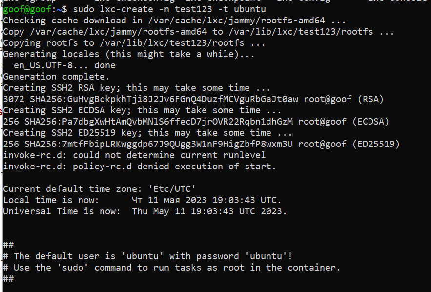
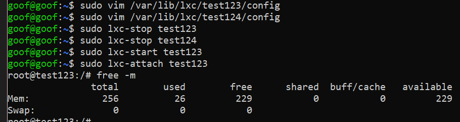
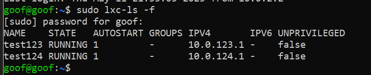

## Denis Karev.
## Группа: Программирование 6 | 3325 / 3424 | 21.09.2022.

### Containerisation HomeWork 02

### Task 01:
1. запустить контейнер с ubuntu, используя механизм LXC
2. ограничить контейнер 256 Мб ОЗУ и проверить, что ограничение работает
3. добавить автозапуск контейнеру, перезагрузить ОС и убедиться, что контейнер действительно запустился самостоятельно
4. при создании указать файл, куда записывать логи
5. после перезагрузки проанализировать логи

### 1.
#### Создаем сразу две машины для дальнейших задач.
`sudo lxc-create -n test123 -t ubuntu`

`sudo lxc-create -n test124 -t ubuntu`


#### Второй скрин аналогичный.

### 2.3
#### Конфигурация машин лежит /var/lib/lxc/'имя машины'/config
#### Добавим автозапуск, заодно и IP пропишем, на будущее
#### А в конфиги мы лезем потому что `sudo lxc-cgroup -n test123 memory.max "256M"` не работает %))
`sudo vim /var/lib/lxc/test123/config`
```bash
# Container specific configuration
lxc.cgroup2.memory.max = 256M
lxc.start.auto  =  1

lxc.net.0.ipv4.address = 10.0.123.1/24
```

`sudo vim /var/lib/lxc/test124/config`
```bash
# Container specific configuration
lxc.cgroup2.memory.max = 256M
lxc.start.auto  =  1

lxc.net.0.ipv4.address = 10.0.124.1/24
```
#### Результат:
`sudo lxc-attach test123`

`free -m`



`sudo reboot`


### 4.
#### При создании не указали попробуем при запуске )
`sudo lxc-start test123 -o ~/test123.log`
#### Файл пуст. Типа не сработало )
#### Придется лезть опять в конфиги
`sudo vim /var/lib/lxc/test123/config`
```bash
lxc.log.file = lxc_test123_log
lxc.log.level = 0
```
`sudo vim /var/lib/lxc/test124/config`
```bash
lxc.log.file = lxc_test124_log
lxc.log.level = 1
```
#### В логах много разной полезной информации ))) и не только
```bash
lxc-start test124 20230511213328.532 INFO     start - start.c:lxc_spawn:1765 - Cloned CLONE_NEWNS
lxc-start test124 20230511213328.532 INFO     start - start.c:lxc_spawn:1765 - Cloned CLONE_NEWPID
lxc-start test124 20230511213328.532 INFO     start - start.c:lxc_spawn:1765 - Cloned CLONE_NEWUTS
lxc-start test124 20230511213328.532 INFO     start - start.c:lxc_spawn:1765 - Cloned CLONE_NEWIPC
lxc-start test124 20230511213328.532 INFO     start - start.c:lxc_spawn:1765 - Cloned CLONE_NEWNET
lxc-start test124 20230511213328.532 INFO     start - start.c:lxc_spawn:1765 - Cloned CLONE_NEWCGROUP
```
### Task 2*:
1. Настроить автоматическую маршрутизацию между контейнерами. Адреса можно взять: 10.0.12.0/24 и 10.0.13.0/24.
#### в нашем случае уже 10.0.123.0/24 и 10.0.124.0/24
#### и пока не удалось попинговать ((
#### несмотря на -- выдержку из логов )
```
lxc-start test124 20230511212507.791 DEBUG    network - network.c:netdev_configure_server_veth:852 - Instantiated veth tunnel "vethjxP629 <--> vethmWpxUo"
```