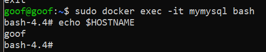
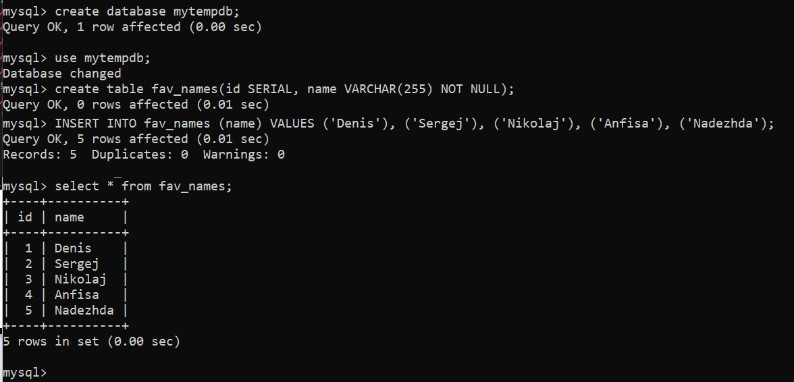
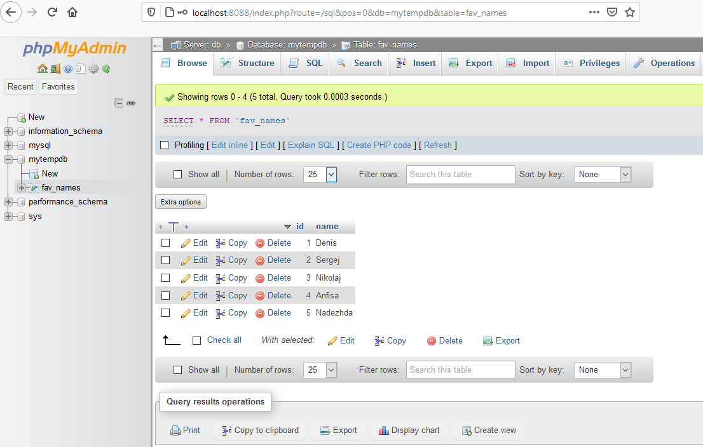

## Denis Karev.
## Группа: Программирование 6 | 3325 / 3424 | 21.09.2022.

### Containerisation HomeWork 03
#### Урок 3. Введение в Docker

### Task 01:
 1. запустить контейнер с БД, отличной от mariaDB, используя инструкции на сайте: hub.docker.com
2. добавить в контейнер hostname такой же, как hostname системы через переменную
3. заполнить БД данными через консоль
4. запустить phpmyadmin (в контейнере) и через веб проверить, что все введенные данные доступны.

### На знаю почему, решил сначала поскачивать образы, потом уже машинки создавать
```bash
sudo docker pull mysql
sudo docker pull phpmyadmin
```
### 1. Создание контейнера mysql
```bash
docker run --name mymysql -e MYSQL_ROOT_PASSWORD=r -h $(hostname) mysql
```
### 2. Имя хоста в контейнере mymysql

### 3. Вход в контейнер, вход в mysql, создание и наполнение базы
```bash
sudo docker exec -it mymysql bash
mysql -u root -p
create database mytempdb;
use mytempdb;
create table fav_names(id SERIAL, name VARCHAR(255) NOT NULL);
INSERT INTO fav_names (name) VALUES ('Denis'), ('Sergej'), ('Nikolaj'), ('Anfisa'), ('Nadezhda');
exit # from mysql cli
exit # from mysql container
```

### Создание контейнера phpmyadmin
### 
```bash
sudo docker run --name myphpad --link mymysql:db -p 8088:80 phpmyadmin
```
### 4. Вход и phpmyadmin а наружи виртуалки с пробросом портов потому что NAT
