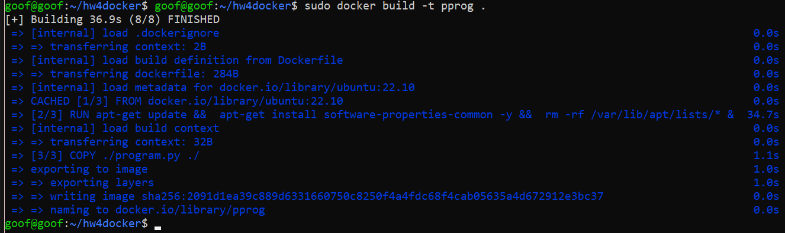
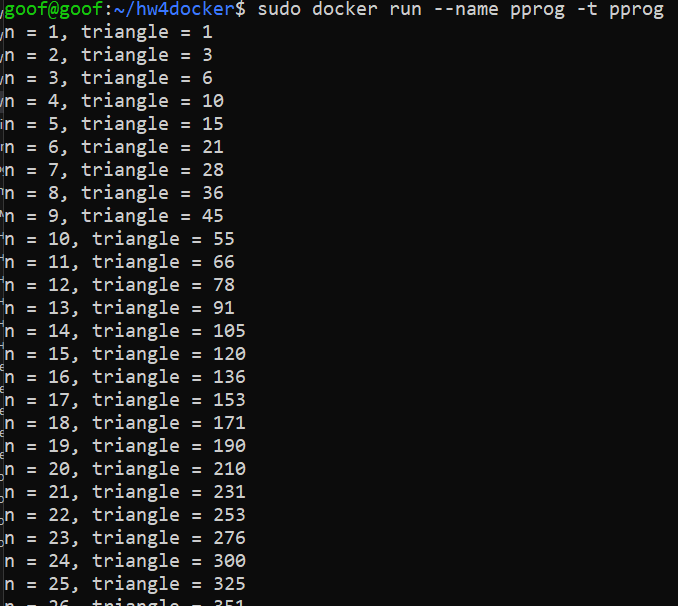
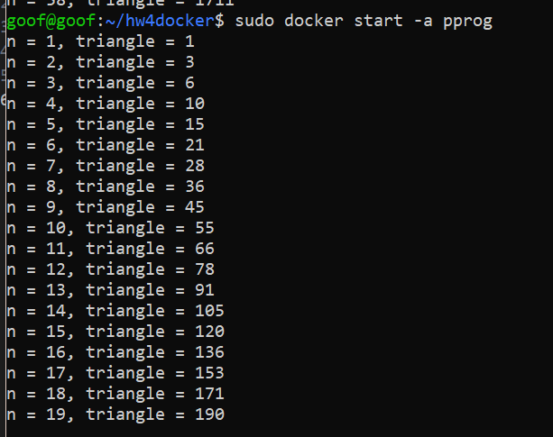

## Denis Karev.
## Группа: Программирование 6 | 3325 / 3424 | 21.09.2022.

### Containerisation HomeWork 04
#### Урок 4. Docker: Dockerfiles, слои, архитектура

### Task 01:
 1. Задание: необходимо создать Dockerfile, основанный на любом образе (вы в праве выбрать самостоятельно).
В него необходимо поместить приложение, написанное на любом известном вам языке программирования (Python, Java, C, С#, C++).
При запуске контейнера должно запускаться самостоятельно написанное приложение.

### Програмка на питоне выбралась почему-то ) простенькая, но на питоне (печатает юреугольные числа если что, до случайного n)
```python
#!/bin/python3
from random import randint
def triangle_numbers(n):
    for i in range(1, n + 1):
        print("n = {0}, triangle = {1}".format(i, (i ** 2 + i)//2))

triangle_numbers(randint(10, 101))
```
```bash
mkdir hw4docker
cd hw4docker
vim Dockerfile
```
### Dockerfile
```Dockerfile
FROM ubuntu:22.10
    RUN apt-get update && \
        apt-get install software-properties-common -y && \
        rm -rf /var/lib/apt/lists/*
COPY ./program.py ./
ENTRYPOINT ["python3", "./program.py"]
```
### Почему ubuntu:22.10 никто не знает, можно бы было и просто образ python взять )))
```bash
sudo docker build -t pprog .
```

```bash
sudo docker run --name pprog pprog
```

```bash
sudo docker start -a pprog
```
### Все также выдает случайный результат
