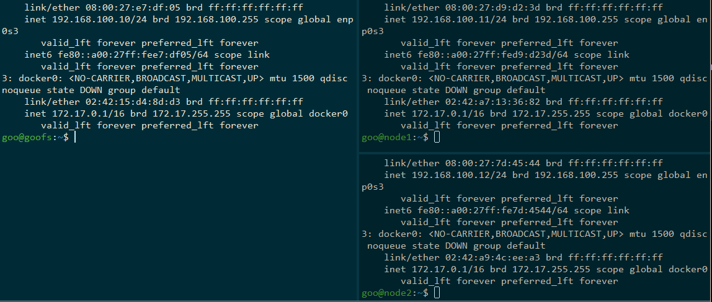
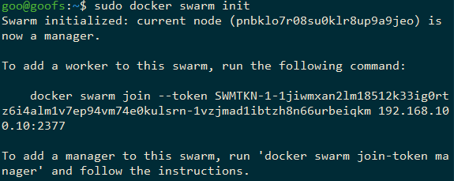
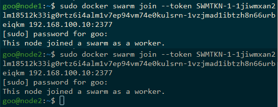
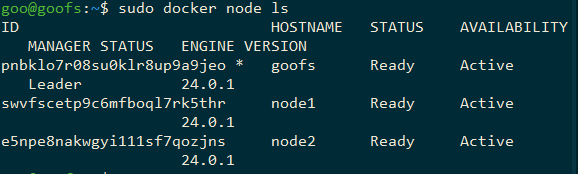
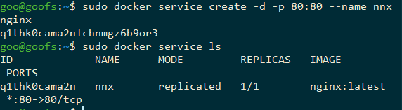
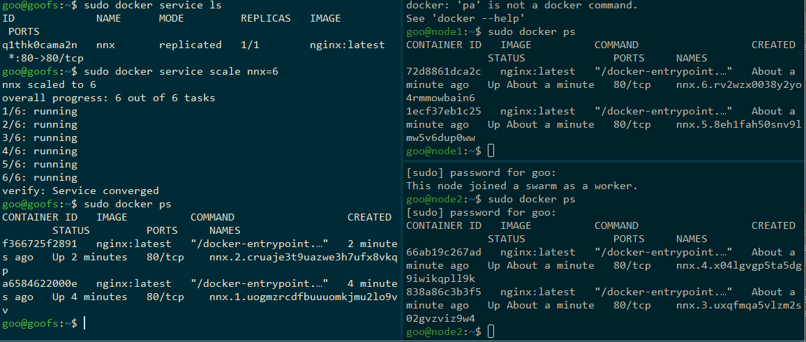
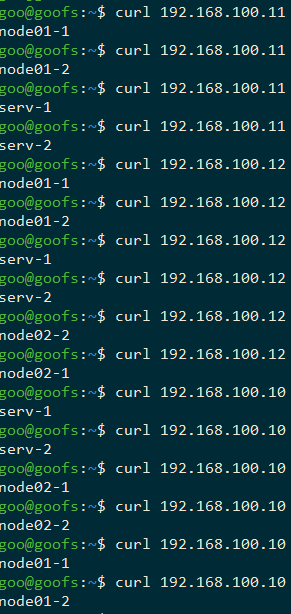

## Denis Karev.
## Группа: Программирование 6 | 3325 / 3424 | 21.09.2022.

### Containerisation HomeWork 05
#### Урок 5. Docker Compose и Docker Swarm

### Task 01:

1. создать сервис, состоящий из 2 различных контейнеров: 1 - веб, 2 - БД
2. далее необходимо создать 3 сервиса в каждом окружении (dev, prod, lab)
3. по итогу на каждой ноде должно быть по 2 работающих контейнера
4. выводы зафиксировать

__! ИЛИ повторить развёртывание сервиса nginx с несколькими репликами на разных нодах.__

### Task 02:
Задание 2*:
1. нужно создать 2 ДК-файла, в которых будут описываться сервисы
2. повторить задание 1 для двух окружений: lab, dev
3. обязательно проверить и зафиксировать результаты, чтобы можно было выслать преподавателю для проверки.

<!-- ### compose.yaml Just in case %))
```yaml
#version: '3.9'
services:
    db:
        image: mariadb:10.10.2
#        restart: always
        environment:
            MYSQL_ROOT_PASSWORD: root
    
    adminer:
        image: adminer:4.8.1
#        restart: always
        ports: 
            - 6060:8080
``` -->
### Swarm initialisation

### Nodes and their addresses used in a swarm
| node name | IP-address |
|--|--|
| serv | 192.168.100.10 |
| node1 | 192.168.100.11 |
| node2 | 192.168.100.12 |


```bash
# sudo su %))
docker swarm init
# Join on other nodes on each node
docker swarm join --token $TOKEN 192.168.100.10:2377
```
 // init
 // on each node
 // status
```bash
# Create nginx service
docker service create -d -p 80:80 --name nnx nginx
# docker node ls # ps
```
 // create
```bash
# Scale service nnx
docker service scale nnx=6
```
 // scale = 6
```bash
# and make each docker nginx container different from each other
# on serv-node
docker exec -it f366 bash
echo serv-1 > /usr/share/nginx/html/index.html && exit
docker exec -it a658 bash
echo serv-2 > /usr/share/nginx/html/index.html && exit
# on node01
docker exec -it 72 bash
echo node01-1 > /usr/share/nginx/html/index.html && exit
docker exec -it 1e bash
echo node01-2 > /usr/share/nginx/html/index.html && exit
# on node02
docker exec -it 66 bash
echo node02-1 > /usr/share/nginx/html/index.html && exit
docker exec -it 83 bash
echo node02-2 > /usr/share/nginx/html/index.html && exit
```
```bash
# to see what server (node) answers on curl get
curl 192.168.100.10 # some times
```

<!-- 
```bash
#123123
docker stack deploy
``` -->
### Answers like those we can watch on any of nodes too